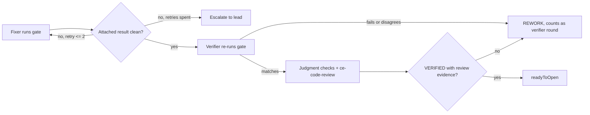

# Verifier Mechanical Gate - Plan

## Goal Capsule

- **Objective:** Every VERIFIED a fixer/verifier team produces rests on mechanical checks that ran and passed, in the fix-queue workflow and in interactive agent teams alike, and the verifier agent spends its tokens only on judgment.
- **Means:** One standalone gate script owns the deterministic checks the verifier currently executes as prose; the fixer runs it before submitting, fix-queue routes on its result, and the verifier re-runs it.
- **Product authority:** Tracked by #133. This work closes #127 and #116 item 2; #116's remaining item (workflow agents lack the Agent tool) stays open.
- **Open blockers:** None.

---

## Product Contract

### Summary

Add a gate script that runs identity, field format, tree binding, scope-fence containment, fail-before/pass-after, repo verification and the review-evidence rule as code. The fixer attaches its result, fix-queue returns gate failures without dispatching the verifier, and the verifier re-runs the gate and keeps only the judgment checks.

### Problem Frame

The verifier profile (`agents/verifier.md`, checks 1, 2, 4, 8 and 9) tells an LLM agent to execute git and test commands and compare their output. In #96 the first verifiers returned CLEARED without running those checks or `ce-code-review`, and prose instructions had no way to stop them. In #116 a fixer's `verified_tree` was not 40-character hex; the workflow's field check returned REWORK and spent round 1 of the two-round cap on a formatting defect, so the verifier saw the code only twice. #109 shows the verified-tree recipe itself swallows failures.

Both agent profiles run on `model: inherit`, so every one of these mechanical comparisons is paid at the parent model's price on every round. And because the checks live in prose, the fix-queue workflow (whose own body cannot run shell commands) has no way to confirm they happened — it can only check that fields are present and well-formed.

### Key Decisions

- **One gate for both paths.** The same gate serves the fix-queue workflow and interactive teams where a lead hands a submission to a verifier teammate; there is one source of truth for the checks. (session-settled: user-directed — chosen over a workflow-only gate: two copies of the same checks would drift.) Governs R10, R13.
- **The fixer runs the gate; the verifier re-runs it.** The fixer's run gives fast feedback and lets fix-queue route without a verifier; the verifier's independent run catches a result that was fabricated, stale, or produced against the wrong tree. (session-settled: user-directed — chosen over a dedicated cheap runner agent and over a three-layer setup: no extra agent per round while keeping two independent runs.) Governs R7, R8, R9.
- **The verifier does not trust the gate's attached output.** (session-settled: user-directed — chosen over trusting the gate output and over spot-checking a fact or two: a single trusted run is a single point of failure.) Governs R9.
- **Gate failures have their own small cap.** (session-settled: user-directed — chosen over unlimited free retries and over counting test failures as verifier rounds: rounds should measure verifier disagreement, but a stuck fixer must still escalate.) Governs R11.
- **The full mechanical set is in scope now.** (session-settled: user-directed — chosen over git-facts-only and over fields-plus-#127-only: smaller versions leave the #96 skip risk for tests and identity.) Governs R1.
- **A test-less diff is not-applicable, not a pass.** (session-settled: user-directed — chosen over failing unless labelled docs and over always failing: many fixes in this plugin are prose-only.) Governs R4.
- **This work closes #127 and #116 item 2.** (session-settled: user-directed — chosen over keeping them as separate narrower fixes: they are the same mechanism.) Governs R11, R12.
- **Only the SHA side of fail-before/pass-after is mechanical.** A script can observe a test's outcome at the base, but not whether that outcome is a new-behavior pin, a regression pin, or a test that could not run, so that classification stays with the verifier. Governs R5.

### Actors

- A1. Fixer — implements one issue, runs the gate, submits.
- A2. fix-queue workflow — orchestrates rounds and routes on gate and verdict results; cannot itself run commands.
- A3. Verifier — re-runs the gate, performs judgment checks, returns a verdict.
- A4. Lead — in interactive teams, relays a submission to the verifier; in either path, receives escalations.

### Requirements

**What the gate checks**

- R1. A single gate covers every mechanical check: identity (HEAD equals the submitted SHA and the merge base equals the submitted base), submission field presence and format including 40-character hex SHAs, tree binding to the tree `ce-work` verified, the `ce-work` evidence blocks (each `complete` with `standalone_shipping_skipped: true`, and their `changed_files` and the `--no-renames` diff containing each other in both directions), scope-fence containment, the changed tests' results at the base and the SHA, and the dispatch prompt's repo verification commands.
- R1a. The gate checks scope-fence containment only against a fence the lead set as paths or globs; with no such fence it reports not-applicable and the verifier judges containment against the prose or advisory fence.
- R2. The gate derives facts it can read from git (SHA, base, tree, changed files and counts) itself, and treats any mismatch with the submission's copy as a failure.
- R3. The gate reports a machine-readable result with each check's outcome (pass, fail, or not-applicable) and, for every failure, the exact command output or mismatch a fixer needs to correct it.
- R4. When a diff changes no test files, the fail-before/pass-after check reports not-applicable, never pass, and the verifier must state why no test was warranted against the issue's acceptance criteria.
- R5. The gate fails a changed test only when it does not pass at the SHA; it reports each changed test's outcome at the base as data, and classifying that outcome (a new-behavior pin that must fail for the issue's stated reason, a labelled regression pin, or not run because a non-test file is missing) remains the verifier's.
- R6. When the dispatch prompt names no runnable verification command, the repo-verification check reports not-applicable rather than guessing a command; the verifier then finds the repo's verification commands, runs them at the SHA and reports the actual numbers, and a verdict that does neither is not VERIFIED.

**Who runs it, and what happens on failure**

- R7. The fixer runs the gate before every submission, including rework resubmissions, and attaches the gate's result to the submission.
- R8. fix-queue keeps its own field presence and format check authoritative, and also rejects a submission whose attached gate result is missing, malformed, for a different SHA, contains a failure, or derives a SHA, base, tree or changed-file list that differs from the submission's; it returns that submission to the fixer without dispatching the verifier.
- R9. The verifier re-runs the gate in its own checkout at the submitted SHA and refuses VERIFIED when its run fails or disagrees with the attached result.
- R10. In interactive agent teams the lead and verifier use the same gate, so the checks it owns are never left to prose on either path.

**Rework accounting**

- R11. A gate failure returned under R8 does not consume one of the two verifier rework rounds; each round allows at most two gate retries, after which the item escalates to the lead with the latest gate result.

**Verdict enforcement**

- R12. fix-queue never places an item in `readyToOpen` when the verdict lacks `ce-code-review` evidence in the form #96 defines (a depth, or `not run: <reason>`), or says the review did not run.
- R12a. The verdict carries the verifier's own gate result, and fix-queue never places an item in `readyToOpen` when that result is missing, malformed, for a SHA other than the submitted one, contains a failure, or reports fail-before/pass-after not-applicable while the verdict gives no R4 justification.

**Verifier scope**

- R13. The verifier profile stops instructing the agent to execute the checks the gate owns; it keeps the gate re-run, `ce-code-review`, mutation design, guard-code bypass hunting, acceptance-criteria fit, the R4, R5 and R6 judgments, and scope-fence containment when R1a reports not-applicable.

**Proof**

- R14. The gate has its own automated tests covering each check's pass, fail and not-applicable outcomes, and the fix-queue harness pins R8, R11, R12 and R12a.

### Key Flows

- F1. Workflow round
  - **Trigger:** A fixer finishes an implementation or rework in fix-queue.
  - **Actors:** A1, A2, A3
  - **Steps:** Fixer runs the gate and attaches the result. fix-queue checks the attached result; on failure it returns the item to the fixer, up to two gate retries in the round. On a clean result it dispatches the verifier, which re-runs the gate, then performs the judgment checks and returns a verdict. fix-queue admits the item to `readyToOpen` only when the verdict is VERIFIED with review evidence.
  - **Covered by:** R7, R8, R9, R11, R12, R12a, R13
- F2. Interactive team handoff
  - **Trigger:** A fixer teammate reports a submission to the lead.
  - **Actors:** A1, A3, A4
  - **Steps:** Fixer runs the gate and includes the result in its submission. The lead relays it to the verifier, which re-runs the gate before any judgment work and returns the verdict to the lead.
  - **Covered by:** R7, R9, R10, R13

### Acceptance Examples

- AE1. **Covers R8, R11.** **Given** a submission whose `verified_tree` is not 40-character hex, **when** fix-queue receives it, **then** the fixer gets the exact failure back, no verifier is dispatched, and the verifier round count is unchanged.
- AE2. **Covers R11.** **Given** the same round has already returned two gate failures, **when** a third submission's gate result still fails, **then** the item escalates to the lead with that result instead of retrying.
- AE3. **Covers R4.** **Given** a fix that edits only a skill's prose, **when** the gate runs, **then** fail-before/pass-after reports not-applicable and the verifier's verdict states why no test was warranted.
- AE4. **Covers R9.** **Given** an attached gate result that passes but was produced for an earlier SHA, **when** the verifier re-runs the gate at the submitted SHA, **then** the verifier refuses VERIFIED.
- AE5. **Covers R12.** **Given** a verdict of VERIFIED whose first line says `not run: no Agent tool`, **when** fix-queue processes it, **then** the item does not enter `readyToOpen`.
- AE6. **Covers R12a.** **Given** a VERIFIED verdict that carries no gate result of the verifier's own, **when** fix-queue processes it, **then** the item does not enter `readyToOpen`.

### Success Criteria

- No VERIFIED reaches `readyToOpen` on either path without the mechanical checks having run and passed (or reported not-applicable under R4 or R6).
- A formatting defect in a submission never reduces the number of times the verifier sees the code.
- Per-round verifier token use becomes separable into gate re-run and judgment work, so later model-tier changes can be measured rather than guessed.

### Scope Boundaries

- Changing either agent's model or adding per-role model settings is out of scope; this work only makes the effect measurable.
- Running `ce-code-review`'s reviewers as workflow steps and a separate DEGRADED outcome (#116's Agent-tool item) stay out of scope.
- Mutation testing stays with the verifier as a judgment check; the gate does not generate or run mutants.
- Post-merge acceptance replay, a closer or integrator role, and delta re-verification for rebased lane items are separate ideas in `docs/ideation/2026-10-09-fixer-verifier-agent-team-ideation.html`.
- The #129 test gap is not part of this work.

### Dependencies / Assumptions

- R12 enforces the verdict first-line rule #96 defined, merged in PR #140 (`agents/verifier.md`, `skills/writing-dispatch-prompts/reference/verifier-verdict.md`); this work enforces it without redefining it.
- Assumption: the fix-queue workflow body cannot run shell or git commands, so only agents can execute the gate. The test harness bans `process`, `require` and `import`; no file states the runtime's limits directly.
- Assumption: the fixer receives the dispatch prompt's verification commands through the shared dispatch header, as the verifier does (`workflows/fix-queue.js` ~line 331).
- The gate must run against repositories other than this plugin, using whatever test and verification commands their dispatch prompts name.

### Outstanding Questions

**Deferred to Planning**

- Where the gate lives and how it is invoked from both a fixer worktree and a verifier checkout.
- How the gate result is carried in the submission and recognized by fix-queue (a new submission field or an extension of an existing one).
- How the gate identifies "changed tests" in repositories with different test layouts.
- Whether the two gate retries per round also draw on the per-fix token budget floor.

### Sources / Research

- `agents/verifier.md` lines ~49-57: the nine checks; checks 1, 2, 4, 8 and 9 are command recipes.
- `workflows/fix-queue.js`: `MAX_REWORK` (~line 107), `missingFields()` (~lines 381-390), field-check REWORK path (~lines 413-421), `VERDICT_SCHEMA` free-text `coverage` (~lines 181-202).
- `skills/writing-dispatch-prompts/reference/ce-work-evidence.md`: tree-binding and file-containment evidence rules.
- `tools/fix-queue.test.mjs`: harness with fake `agent()`, `pipeline()` and budget; no real git.
- Issues #96, #109, #116, #127, #133.
