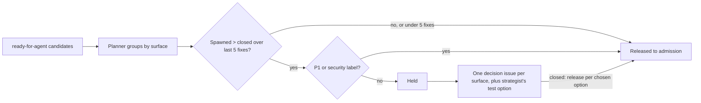

# Planner Role and Convergence Loop - Plan

## Goal Capsule

- **Objective:** Fixing work on any repo the fixer/verifier team serves converges: each code surface closes issues faster than its fixes spawn new ones, a surface that leaks becomes one human design decision instead of a stream of point fixes, and fix batches go to work that pays off.
- **Means:** A planner role that runs before fix-queue admission (and interactively for a lead), measures convergence per surface, holds back non-converging surfaces, and escalates each to one decision issue with options including a test-strategy option from the test/quality strategist.
- **Product authority:** Tracked by #134. This plan covers the convergence loop only; finding classification at filing and triage (#137) and the strategist's broader per-fix role (#138) are separate work blocked by this one.
- **Open blockers:** None.

---

## Product Contract

### Summary

Add a planner role to the fixer/verifier team. Before each fix-queue batch, and whenever a lead asks, it groups candidate issues by the code they touch, compares follow-ups spawned to issues closed over each surface's recent fixes, holds back surfaces that are not converging, and opens one decision issue per held surface for a human to choose redesign, accept-and-defer, or narrow-the-scope.

### Problem Frame

fix-queue admits every open issue labelled `ready-for-agent`; by convention leads launch it on `bug` issues. Fixing work files every out-of-scope finding from review as a new issue, which the Loose Ends rule pre-approves, and triage typically labels those findings `bug` + `ready-for-agent`, so they flow straight back into the queue.

In a sibling internal plugin since 2026-09-09, 179 issues were filed and 103 remain open against 200+ merged PRs; about 39% of the new issues were spawned by fixing work. They cluster on one surface, the loose-ends artifact guard, whose in-house text matching over shell commands and markdown leaks at each new input shape. Recent fixes on it filed 2-4 follow-ups each (PRs #515, #510, #507). Of six recent spawned issues, five describe inputs a real session can produce (#514 is the theoretical one), so the follow-ups are not noise to filter out; they are evidence that patching this design does not converge. `skills/writing-dispatch-prompts/reference/guard-code-precedents.md` already records that blocklisting input shapes failed across four review rounds.

Nothing in the team today asks whether a surface is converging, so no one ever decides to stop patching. The queue grows, agent time goes to point fixes, and the design question that would end the stream is never posed.

### Key Decisions

- **The convergence loop is this plan's scope; finding classification is not.** (session-settled: user-directed — chosen over finding classification first and over all four layers in one plan: the evidence points at a leaking design, which only the loop addresses.) Governs R1-R13.
- **The planner is a new team role and a fix-queue step.** (session-settled: user-directed — chosen over a fix-queue step only and over a standalone report: the same role serves batches and interactive leads.) Governs R1, R2.
- **A surface is the code path an issue's fix touches.** (session-settled: user-directed — chosen over a surface label, both, and planner judgment: objective and needs no new labelling discipline.) Governs R3, R4.
- **A surface trips when follow-ups spawned exceed issues closed over its last 5 merged fixes.** (session-settled: user-directed — chosen over repeat-spawner and open-count triggers: it measures the treadmill directly.) Governs R6, R7.
- **Escalation is one ready-for-human decision issue per held surface.** (session-settled: user-directed — chosen over requiring an ADR and over the planner drafting the redesign: a human decides, recorded once.) Governs R9-R11.
- **The test/quality strategist joins only at escalation in this plan.** (session-settled: user-directed — chosen over a full strategist role here, a separate later plan only, and merging it into the planner: it is a distinct role whose class-level test strategy is a root-cause option.) Governs R10.
- **P1 and security-relevant fail-open bugs bypass a hold.** (session-settled: user-directed — chosen over an absolute hold and over per-issue human overrides: serious defects should not wait on a design decision.) Governs R8.
- **The planner never closes, relabels or defers existing issues; it may only comment.** The decision issue is the single place a class of bugs is dispositioned, and the human who closes it applies the chosen option's relabelling. (session-settled: user-directed — chosen over the planner relabelling and over a hold label: a comment makes holds visible without the planner changing issue state.) Governs R11, R12.
- **Each decision option has its own effect on held issues.** (session-settled: user-directed — chosen over releasing everything on close: release-all would send an accepted-and-deferred class straight back to fixers.) Governs R11.

### Actors

- A1. Planner — groups candidates by surface, measures convergence, holds and escalates.
- A2. Test/quality strategist — contributes a test-strategy option to each decision issue.
- A3. fix-queue workflow — runs the planner before admission and admits only what the planner releases.
- A4. Lead — runs the planner interactively before choosing issues; receives held-surface reports.
- A5. Human decision-maker — chooses an option on a decision issue and closes it.
- A6. Lead and other sessions doing fixing work — record the parent link on every follow-up they file; the fixer reports follow-ups to the lead and does not file them.

### Requirements

**The planner role**

- R1. The team gains a planner role, alongside fixer and verifier, that fix-queue runs before admitting any candidate.
- R2. A lead can run the planner interactively on a repo and get the same per-surface report and holds before choosing issues by hand.

**Surfaces and lineage**

- R3. Each candidate issue's surface is the set of code paths its fix touches or is predicted to touch; the planner makes that prediction itself, read-only, before admission claims or caps anything, and issues that share a surface are grouped together.
- R4. Every follow-up issue that fixing work files records the issue or PR whose work spawned it, and inherits that parent's surface.
- R4a. When a follow-up has no recorded parent, the planner infers one from issue or PR references in its body, counts it toward R6, and marks it as inferred in the R13 report.
- R5. The planner works against any repository fix-queue targets, not only this plugin.

**Convergence and holds**

- R6. For each surface, the planner counts follow-up issues spawned and issues closed over that surface's last 5 merged fixes, counting only fixes merged after the surface's most recent decision issue was closed.
- R7. A surface whose spawned count exceeds its closed count over that window is not converging; a surface with fewer than 5 merged fixes is never held.
- R8. The planner holds a non-converging surface's candidates out of admission, except issues labelled `priority:P1` or carrying a security label; fail-open wording in an issue body alone does not qualify.

**Escalation**

- R9. For each newly held surface the planner opens one `ready-for-human` decision issue carrying the convergence evidence, the held issues, and the options redesign, accept the known limits and defer the class, or narrow the guard's scope, and posts one comment on each held issue linking that decision issue.
- R10. The test/quality strategist adds a test-strategy option to each decision issue, naming a class-level approach for the surface rather than one example test per edge case.
- R11. While a surface's decision issue is open the planner does not open a second one. When it closes, the chosen option decides release: redesign keeps the held issues held until the redesign issue closes; accept-and-defer has the human relabel them `deferred` on closing, so the planner releases none of them; narrow-scope releases only held issues still inside the narrowed scope.

**Boundaries of the planner's authority**

- R12. The planner never closes, relabels, or changes the state of existing issues; it only holds candidates back, opens decision issues, and comments on held issues.
- R13. Every planner run reports, per surface, the spawned and closed counts (recorded and inferred separately), whether it is held, which candidates were released or held and why, and each open decision issue with its age.

### Key Flows

- F1. Batch admission
  - **Trigger:** A lead launches fix-queue.
  - **Actors:** A1, A2, A3
  - **Steps:** fix-queue runs the planner on the open `ready-for-agent` candidates. The planner groups them by surface and measures each surface. Converging surfaces' candidates are released for admission. Non-converging surfaces are held, bypass-eligible issues excepted; for each newly held surface the planner opens a decision issue and the strategist adds its option. fix-queue admits only released candidates and includes the planner report in its result.
  - **Covered by:** R1, R3, R6, R7, R8, R9, R10, R13
- F2. Interactive planning
  - **Trigger:** A lead wants to pick issues by hand.
  - **Actors:** A1, A4
  - **Steps:** The lead runs the planner, reads the per-surface report, and chooses only from released candidates.
  - **Covered by:** R2, R13
- F3. Decision and release
  - **Trigger:** A human closes a surface's decision issue with a chosen option.
  - **Actors:** A5, A1
  - **Steps:** The human applies the chosen option's relabelling when closing. The next planner run sees the closed decision and releases candidates as R11 directs. A redesign outcome is tracked as its own issue.
  - **Covered by:** R11

### Acceptance Examples

- AE1. **Covers R6, R7, R8, R9.** **Given** the artifact-guard surface's last 5 merged fixes spawned 12 follow-ups and closed 5 issues, **when** fix-queue runs, **then** its `ready-for-agent` candidates are held, one decision issue is opened with those counts, and the rest of the batch proceeds.
- AE2. **Covers R8.** **Given** that surface is held, **when** a P1 issue on it is a candidate, **then** the P1 is admitted.
- AE3. **Covers R7.** **Given** a surface with 3 merged fixes that spawned 6 follow-ups, **when** the planner runs, **then** the surface is not held.
- AE4. **Covers R11.** **Given** a held surface whose decision issue is still open, **when** the planner runs again, **then** no second decision issue is opened and the surface stays held.
- AE5. **Covers R12.** **Given** a held surface, **when** the planner runs, **then** none of the held issues' labels or states change.
- AE6. **Covers R4.** **Given** a fixer's review turns up an out-of-scope edge case, **when** the follow-up issue is filed, **then** it records the parent issue or PR and the planner counts it against that surface.
- AE7. **Covers R6, R11.** **Given** a surface whose decision issue was just closed and which has had no merged fixes since, **when** the planner runs, **then** the surface is not held and no new decision issue is opened.

### Success Criteria

- On the sibling plugin's loose-ends artifact guard, the first planner run holds the surface and produces one decision issue in place of further point fixes.
- Over time, each surface's open issue count falls or stays flat while fix-queue keeps running.
- Decision issues close with a chosen option within an agreed period rather than accumulating in `ready-for-human`; the R13 report makes their age visible.

### Scope Boundaries

- Classifying review findings at filing and gating triage on reachability are #137.
- The strategist's per-batch test-expectation role is #138.
- Carrying out a redesign is separate tracked work opened from the decision issue.
- Changing the Loose Ends filing rule is out of scope; the loop works with every finding filed.
- Tuning the window size or trigger from data is deferred until runs produce data.

### Dependencies / Assumptions

- Assumption: follow-up issues filed before this work have no recorded parent, so early windows undercount spawned issues until R4 has been in place for 5 fixes on a surface; R4a's inference covers that gap.
- fix-queue's admission agent predicts files only after it has claimed an issue (`status:in-progress`) and created its worktree, and only for issues admitted under the fix cap, so the planner cannot reuse that output; R3 requires the planner's own read-only prediction.
- The bypass in R8 depends on `priority:P1` and security labels being applied reliably at triage; repos without them get no bypass.

### Outstanding Questions

**Deferred to Planning**

- How the parent link in R4 is recorded so the planner can read it reliably across repos (issue relationship, a body field, or a label).
- How code paths are normalized into a surface (file, directory, or module) so that small refactors do not split a surface.
- Where the planner counts "merged fixes" from: PRs closing issues on the surface, or fix-queue run records.
- How the strategist is invoked at escalation and what its option must contain at minimum; no strategist profile exists yet, so this plan builds only the minimum R10 needs without pulling in #138.
- The default period after which an open decision issue counts as stalled in the R13 report.
- Whether a decision issue filed by hand for a surface counts as its open decision under R11.

### Sources / Research

- `workflows/fix-queue.js`: admission filters open issues on `ready-for-agent`; the admission schema predicts files per fix.
- `skills/issue-triage/SKILL.md`: no reachability or convergence criterion for `ready-for-agent`.
- `skills/writing-dispatch-prompts/reference/guard-code-precedents.md`: "Blocklisting input shapes fails".
- A sibling internal plugin's issue tracker: issues #514, #506, #498, #490, #487, #481; PRs #515, #510, #507; `hooks/lib/loose-ends.mjs`.
- Related: #133 (`docs/plans/2026-10-09-1811-feat-verifier-mechanical-gate-plan.md`), #137, #138, `docs/ideation/2026-10-09-fixer-verifier-agent-team-ideation.html` idea 4.
