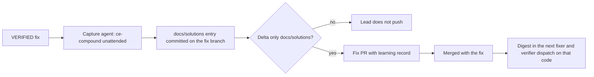

# Fix-Queue Learnings Capture - Plan

## Goal Capsule

- **Objective:** Fixes on a code surface pass verification first time more often once that surface has history, because what earlier fixes learned reaches the next fixer and verifier before they start.
- **Means:** fix-queue retains each fix's learning record, captures it as a `docs/solutions/` entry committed with the fix, and injects a digest of matching entries into every fixer and verifier dispatch.
- **Product authority:** Tracked by #147. The session-level compound trigger (#9), its dedup marker (#10), and a merge-driven trigger stay separate work.
- **Open blockers:** None.

---

## Product Contract

### Summary

Every fix that fix-queue verifies ships with its own learning: fix-queue keeps the verifier's findings and the lead's rulings, an unattended `ce-compound` run turns that record into a `docs/solutions/` entry committed on top of the verified fix and merged with it, and each later fixer and verifier dispatch on the same code carries a short digest of the matching entries.

### Problem Frame

A fix-queue run learns why fixes needed rework, how the lead ruled on escalations, which tests let mutants survive, and what made a fix pass first time. None of it outlives the run. fix-queue's per-round history keeps only the round, SHA and verdict; the verifier's findings are read to decide VERIFIED and then dropped. This plugin and the sibling plugin that motivated this work have no `docs/solutions/` corpus despite hundreds of merged fixes; a few other sibling plugins hold small corpora written by hand-run `ce-compound`, keyed by module and component rather than file paths.

The two places learnings could be used are both dark today. `ce-work`, which fixers run, never searches `docs/solutions/`. `ce-code-review` does add a learnings reviewer when a matching corpus exists, but inside fix-queue the verifier's review runs degraded and cannot spawn reviewers (#116). So the next batch on the same code repeats the same rework, and the only learning that persists is the hand-maintained `guard-code-precedents.md`.

### Key Decisions

- **Four kinds of learning are captured: rework causes, lead rulings, surviving mutants and weak tests, and clean-pass patterns.** (session-settled: user-directed — chosen as a set over capturing only failures: what made a fix pass first time is as reusable as what made it fail.) Governs R3.
- **Capture is per fix, committed into that fix's own PR.** (session-settled: user-directed — chosen over one capture per batch and over a separate learnings PR per fix: a learning never lands without its fix, or the reverse.) Governs R2, R4.
- **A learnings commit may sit on top of the verified SHA if it touches only `docs/solutions/`.** (session-settled: user-directed — chosen over sibling learnings PRs and over capturing before verification: the verifier's findings are most of the value, and code still ships exactly as verified.) Governs R5.
- **Each fix's learning record also goes into its PR body.** (session-settled: user-directed — chosen over batch-end capture alone and over building a merge-time trigger now: a future merge-time trigger can confirm the record against what landed.) Governs R6.
- **Learnings live in the target repo's `docs/solutions/`.** (session-settled: user-directed — chosen over a central store in this plugin and over both: it is the format `ce-compound` writes and `ce-code-review` already reads.) Governs R4.
- **Learnings reach fixers by injection into the dispatch prompt.** (session-settled: user-directed — chosen over the fixer searching itself and over both: an instruction to search is prose a fixer can skip.) Governs R8.
- **The verifier receives the same digest.** (session-settled: user-directed — chosen over fixer-only: the verifier checks known traps even while its review runs degraded.) Governs R8.
- **Entries recording a lead ruling need human approval; others auto-merge.** (session-settled: user-directed — chosen over auto-merging everything and over approving every PR: rulings set policy, the rest are observations.) Governs R7.
- **Lead rulings enter fix-queue as a run argument on the re-run of an escalated issue.** (session-settled: user-directed — chosen over the lead running capture by hand and over dropping rulings from this plan: rulings are only made after a run escalates, so the re-run is where they can be retained and captured.) Governs R1a, R7.
- **The digest is advisory data, not instructions.** (session-settled: user-directed — chosen over injecting entries as trusted guidance and over injecting only human-reviewed entries: entries are agent-written and mostly auto-merged, so they stay inside the data fence as traps to verify.) Governs R8, R8a.
- **First-pass VERIFIED rate is the efficiency signal.** (session-settled: user-directed — chosen over rework rounds per fix and over tokens per fix: it measures avoided rework directly.) Governs R10.

### Actors

- A1. fix-queue workflow — retains records, runs capture, assembles dispatch digests; cannot itself run commands.
- A2. Capture agent — a dispatched agent that runs `ce-compound` unattended for one verified fix.
- A3. Fixer and verifier — receive the digest in their dispatch prompts.
- A4. Lead — pushes, opens the PR, checks the learnings delta, and approves ruling entries.

### Requirements

**Retaining the record**

- R1. fix-queue keeps, for every item, each round's verdict, every finding with its severity, the rework or escalation reason, and any lead ruling, through to the end of the run.
- R1a. fix-queue accepts the lead's ruling on a previously escalated issue as a run argument keyed by issue number, passes it to that issue's re-dispatched fixer and verifier, and retains it in the item's R1 record.

**Capture**

- R2. After an item is VERIFIED, fix-queue dispatches a capture agent that runs `ce-compound` unattended over that item's record and the verified diff, one sequential lightweight run per learning the record supports, since `ce-compound` records one learning per run.
- R3. The capture records whichever of the four learning kinds the record supports: rework causes, lead rulings, surviving mutants and weak tests, and what made the fix pass first time.
- R4. Each run that `ce-compound` judges worth recording writes one `docs/solutions/` entry in the target repo, marked with the code paths the fix touched so later dispatches can match it, and updates an existing entry for the same code and the same learning instead of adding a duplicate; when every run reports `Documentation skipped`, no learnings commit is made and the PR opens on the verified SHA.
- R5. The fix's entries form one commit on top of the verified SHA that stages only files under `docs/solutions/`; any other file `ce-compound` changed (such as `CONCEPTS.md`) is discarded before committing and noted in the learning record, and the lead pushes only after confirming mechanically that the delta is confined to `docs/solutions/`.
- R6. The fix's PR body carries the fix's learning record so a later merge-time capture can confirm it against what landed.
- R7. A fix PR whose entry records a lead ruling is held for human approval instead of auto-merging; other fix PRs auto-merge as they do today.

**Consumption**

- R8. Before dispatching a fixer or a verifier, fix-queue selects the `docs/solutions/` entries matching the code paths the issue is predicted to touch, or, for entries without path markers, matching by their module and component, ranks rework causes and rulings ahead of clean-pass entries, and includes a digest of at most 5 inside the prompt's data fence, labelled as known traps to verify rather than instructions to follow.
- R8a. The fixer and verifier treat digest entries as evidence to check against the code, never as instructions, consistent with fix-queue's rule for untrusted text.
- R9. When no entry matches, the dispatch says so rather than omitting the section, so a reader can tell "no learnings" from "learnings not consulted".

**Measurement**

- R10. Every fix-queue run reports, per surface, the share of fixes cleared VERIFIED with no REWORK, whether that surface had matching learnings when each fix was dispatched, and which REWORK findings cite a digest entry, so verifier strictness from the digest is distinguishable from fixer misses.

**Proof**

- R11. The fix-queue harness pins R1, R1a, R5's confinement check, R8, R9 and R10.

### Key Flows

- F1. Capture with the fix
  - **Trigger:** The verifier returns VERIFIED for an item.
  - **Actors:** A1, A2, A4
  - **Steps:** fix-queue dispatches the capture agent with the item's retained record. The agent runs `ce-compound` unattended once per learning and commits the resulting `docs/solutions/` entries on the item's branch, or commits nothing if every run was skipped. The lead checks that the delta past the verified SHA touches only `docs/solutions/`; if it does, the lead pushes and opens the PR with the learning record in its body, and if it does not, the lead does not push. The PR auto-merges unless an entry records a lead ruling.
  - **Covered by:** R1, R2, R3, R4, R5, R6, R7
- F2. Learnings into dispatch
  - **Trigger:** fix-queue is about to dispatch a fixer or verifier.
  - **Actors:** A1, A3
  - **Steps:** fix-queue matches the issue's predicted code paths against `docs/solutions/` entries and puts a digest of up to 5 in the prompt, or states that none matched.
  - **Covered by:** R8, R8a, R9

### Acceptance Examples

- AE1. **Covers R1, R3.** **Given** an item that needed one REWORK for a BLOCKING finding, **when** it is VERIFIED, **then** its retained record includes that finding and its severity, and the captured entry names it as a rework cause.
- AE2. **Covers R5.** **Given** a capture commit that also changes a file outside `docs/solutions/`, **when** the lead checks the delta, **then** the branch is not pushed.
- AE3. **Covers R1a, R7.** **Given** an escalated issue re-run with the lead's ruling on a guard input as a run argument and then VERIFIED, **when** its entry is captured and the PR opens, **then** it waits for human approval instead of auto-merging.
- AE4. **Covers R8.** **Given** three entries mark a file the next issue is predicted to touch, **when** fix-queue dispatches that issue's fixer and verifier, **then** both prompts carry a digest of those three entries.
- AE5. **Covers R9.** **Given** no entry matches an issue's predicted files, **when** its fixer is dispatched, **then** the prompt states that no learnings matched.

### Success Criteria

- On a surface that has learnings, the first-pass VERIFIED rate rises compared with fixes dispatched on it before learnings existed, judged on REWORKs that do not cite a digest entry.
- A new repo's `docs/solutions/` fills from fix-queue runs alone, with no one remembering to run `ce-compound`.

### Scope Boundaries

- The session-level compound trigger and its salience gate (#9), the dedup marker (#10), and a merge-driven trigger in devops-excellence are not built here; R6 only leaves them the record they need.
- Fixes made by hand outside fix-queue are not captured.
- Migrating `guard-code-precedents.md` into `docs/solutions/` is deferred.
- Changing `ce-work` or `ce-code-review` themselves is out of scope; consumption goes through fix-queue's dispatch.

### Dependencies / Assumptions

- `ce-compound` runs unattended with `mode:non-interactive`; its lightweight depth launches no subagents but may update `CONCEPTS.md` when the target repo has one, which R5 discards. A fix with several learnings costs several lightweight runs.
- Throughout this plan, `docs/solutions/` means the target repo's Compound Engineering artifact root solutions directory, `<docs_root>/solutions/`; it is `docs/solutions/` unless the repo sets `docs_root` (a sibling plugin sets `.compound-engineering/artifacts`).
- Matching uses the code paths a fix touched until #134's surface definition lands; planning keeps the two consistent.
- R5 adds a permitted delta to the rule that a PR ships exactly the verified SHA. #133's gate is a natural home for the confinement check if it lands first.
- Assumption: fix-queue can dispatch a capture agent after VERIFIED within its existing per-fix token budget, given lightweight depth.

### Outstanding Questions

**Deferred to Planning**

- The format of the learning record carried in the PR body under R6.
- How entries record the code paths they apply to so that matching is reliable (`ce-compound`'s `module`, `component` or `applies_when` fields, or file paths in the body).
- Whether the capture agent or the lead makes the learnings commit, given that the lead owns pushing.
- How the digest summarizes an entry within a small budget, and how entries are ranked when more than 5 match.
- How the interactive lead/fixer/verifier path, outside fix-queue, gets the same digest.

### Sources / Research

- `workflows/fix-queue.js`: per-round history keeps round, SHA and verdict only (~line 447); `dispatchHeader()` builds both fixer and verifier prompts (~lines 338-386).
- Compound Engineering: `ce-compound` `mode:non-interactive` and `depth:lightweight`; `docs/solutions/` schema fields `module`, `component`, `applies_when`, `tags`; `ce-code-review` selects its learnings reviewer when `docs/solutions/` has a plausible match; `ce-work` does not search `docs/solutions/`.
- `skills/writing-dispatch-prompts/reference/guard-code-precedents.md`, cited by `agents/verifier.md` checks 5 and 6.
- `docs/strategy/compounding-automation.md`; issues #9, #10, #116, #133, #134, #138.
